<p align="center">
  <strong>RAG Command Center</strong><br>
  <em>Real estate intelligence platform — Victoria, BC operations · Canada-wide public listings</em>
</p>

<p align="center">
  <a href="https://garebear99.github.io/RG-Command-Center/"></a>
  <a href="https://github.com/GareBear99/RG-Command-Center/blob/main/LICENSE"></a>
  <a href="https://github.com/GareBear99/RG-Command-Center/stargazers"></a>
  <a href="https://github.com/GareBear99/RG-Command-Center/issues"></a>
</p>

<p align="center">
  
  
  
  
  
</p>

<p align="center">
  <sub>If you find this useful, consider giving it a ⭐ — it helps others discover the project.</sub>
</p>

---

## What Is This?

<p align="center">
  
</p>

> 🔐 **Built on [ARC-Core](https://github.com/GareBear99/ARC-Core)** — the authority / event / receipt kernel. Every signal compile, lead score, pipeline transition, commission event, and inquiry submission is structurally an ARC-Core-shaped event with a SHA-256-addressable fingerprint and a receipt-chain tail.

**RAG Command Center** is a full-stack real estate intelligence platform that combines a **public consumer-facing listing site** with an **internal CRM, lead pipeline, and AI-powered signal engine** for real estate professionals.

**R = Ricki Kohli** · **A = Amit Khatkar** · **G = Gary Doman**

### Two Audiences, One Platform

**Public Site** — Canada-wide listings that anyone can browse, search, filter, and inquire on. Open access, hosted on GitHub Pages.

**Command Center** — Operations dashboard, CRM, pipeline, AI signals, commission tracking. Currently focused on **Victoria, BC** as the primary licensed market, with Vancouver as secondary. Internal access via SHA-256 auth.

The public site serves all of Canada. The command center concentrates on Victoria/Vancouver — lead routing, signal priority, auto-lead generation, and listing sort weight all focus on the licensed markets first. Licensed areas are configurable from the command center settings.

---

## 🔐 Built on ARC-Core

RAG Command Center was built directly on ARC-Core doctrine — every surface in the platform maps to an ARC-Core primitive. This is the real-estate-intelligence equivalent of the signal-intelligence console ARC-Core provides.

| Platform layer | ARC-Core pattern | How it's applied here |
|---|---|---|
| Signal compile (Reddit, Victoria Open Data, Facebook paste) | **Event ingest + fingerprint dedupe** | Every scraped/pasted post becomes an event with a SHA-256-like URL + fuzzy-text fingerprint; replays return the existing signal instead of duplicating (same idempotency contract as `ingest.create_event`) |
| Lead intent scoring (0–100 credibility, budget, neighbourhood) | **Explainable linear `score_event`** | Six weighted components (intent, budget match, neighbourhood, credibility, freshness, licensed-area boost) mirror the inspectable `confidence×50 + severity×4 + … + watchlist×18` recipe |
| Deal scoring (below market, price drop, DOM, comps, features, freshness) | **Explainable linear `score_event`** | Six-component composite 0–100 score with per-component breakdown shown in the listing detail modal |
| Pipeline stages (new → qualified → showing → offer → closed) | **Proposal → evidence → receipt → approval** flow | Each stage transition is an authority-gated mutation with an audit trail, exactly like ARC-Core's proposal lifecycle |
| Licensed-area routing + priority | **Authority gating** | The licensed province/cities decision is an authority claim that gates lead routing, sort priority, and auto-lead generation — same role-based gate as `require_role` |
| Contact CRM + interaction history | **Entity resolution + aliases** | Contacts are canonical entities with aliased identifiers; interaction events append to their timeline |
| Hot / Warm / Cold / Stale freshness decay | **Risk band + 7-day window** | 7-day / 14-day decay is the consumer-domain analog of the 7-day sliding risk window |
| Inquiry → Worker → KV pipeline | **Event → audit → receipt** | Every public inquiry is captured as an event, analytics fires on submit, and the KV store acts as the append-only receipt ledger |
| SHA-256 auth for command center | **Authority-gated execution** | Internal-only surface requires authenticated session — same separation observer (public) / analyst+ (command center) that ARC-Core enforces |
| Cron-triggered hourly compile | **Connector poll cycle** | The Worker `scheduled()` handler is an `filesystem_jsonl`-style connector polling Reddit + Open Data, with dedup and cursor-like freshness tracking |

### What this means concretely

- **Signal dedupe** is URL-based + fuzzy-text (`duplicate_of` field) — the same contract as `events.fingerprint UNIQUE` in ARC-Core.
- **Lead decay** (7d → stale) mirrors the 7-day sliding window in `risk.score_event`.
- **Pipeline kanban** is a proposal ledger with timestamped stage transitions.
- **Commission splits** are first-class events with attached authority (tiered partnership agreement) — billing-reconciliation discipline without needing Stripe's webhook-event wrangling.
- Every score is **explainable** — the detail modal breaks down each component's weight and contribution, in the same spirit as ARC-Core's linear-and-inspectable risk formula.

ARC-Core is the doctrinal substrate. RAG owns the real-estate domain (listings, deals, commissions, BC mortgage math, neighbourhood dictionary); ARC-Core owns the event/authority/receipt discipline that keeps the whole operation tamper-evident and replayable.

Full seven-repo ARC ecosystem + companion consumer applications:

- [ARC-Core](https://github.com/GareBear99/ARC-Core) — authority / event / receipt kernel *(backbone of this platform)*
- [arc-lucifer-cleanroom-runtime](https://github.com/GareBear99/arc-lucifer-cleanroom-runtime)
- [arc-cognition-core](https://github.com/GareBear99/arc-cognition-core)
- [ARC-Neuron-LLMBuilder](https://github.com/GareBear99/ARC-Neuron-LLMBuilder)
- [arc-language-module](https://github.com/GareBear99/arc-language-module)
- [omnibinary-runtime](https://github.com/GareBear99/omnibinary-runtime)
- [Arc-RAR](https://github.com/GareBear99/Arc-RAR)

Companion consumer repos on the same spine: [RiftAscent](https://github.com/GareBear99/RiftAscent) · [Seeded-Universe-Recreation-Engine](https://github.com/GareBear99/Seeded-Universe-Recreation-Engine) · [Proto-Synth_Grid_Engine](https://github.com/GareBear99/Proto-Synth_Grid_Engine) · [Neo-VECTR_Solar_Sim_NASA_Standard](https://github.com/GareBear99/Neo-VECTR_Solar_Sim_NASA_Standard) · [TizWildinEntertainmentHUB](https://github.com/GareBear99/TizWildinEntertainmentHUB) · [Robotics-Master-Controller](https://github.com/GareBear99/Robotics-Master-Controller).

---

## Live URLs

- **Public Site:** https://garebear99.github.io/RG-Command-Center/
- **API Backend:** https://rag-command-center-api.admension.workers.dev/api/health

---

## Public Site — Canada-Wide

Anyone visiting the `.github.io` page can:

- **Browse listings** across all Canadian provinces (BC, AB, ON, QC, MB, SK, NS, NB, and more)
- **Search & filter** by city, price, beds, baths, property type
- **View deal scores** — every listing is scored 0–100% on price positioning, days on market, price drops, and comparables
- **Read resources** — buyer guide, seller guide, mortgage calculator (CMHC-aware), blog, and team profiles
- **Submit inquiries** — contact forms fire to the Cloudflare Worker backend for capture
- **Subscribe to listing alerts** — enter criteria and get matched when new listings land
- **Share listings** — one-click social share to Facebook, Twitter, LinkedIn

### Public Pages

- `index.html` — Homepage with featured listings, hero CTA, inline lead capture
- `deals.html` — Top deals ranked by composite deal score
- `directory.html` — Province-aware listing browser with filters
- `listing-detail.html` — Full detail view with GPS map, price history, score breakdown
- `team.html` — Ricki, Amit, and Gary profiles and contact info
- `mortgage.html` — Canadian mortgage calculator with CMHC insurance
- `buyer-resources.html` — BC buyer's guide
- `seller-resources.html` — BC seller's guide
- `blog.html` / `blog-post.html` — JSON-driven blog with posts by team members

---

## Command Center — Victoria, BC Focus

The internal dashboard is where the team runs daily operations. It's currently configured for **Victoria, BC** as the primary licensed market, with **Vancouver** as secondary. All intelligence, lead routing, and priority scoring key off the licensed area setting.

### Command Center Pages

- `command-center.html` — Main dashboard: stats (hot / warm / cold / stale leads), call queue, top deals, signal feed, pipeline health
- `contacts.html` — CRM contact management with buyer/seller profiles, interaction history, tags
- `pipeline.html` — Kanban-style deal pipeline: new lead → qualified → showing → offer → closed
- `signals.html` — AI Signal Paste: paste a Facebook group post, AI scores intent and extracts lead data. Also auto-compiles signals from Reddit + Victoria Open Data
- `commission.html` — Commission tracker tied to partnership agreement tiered splits
- `analytics.html` — Market analytics: price trends, DOM averages, listing volume
- `email-templates.html` — Email template builder with personalization tokens
- `settings.html` — Licensed area config, data pipeline controls, SMTP settings
- `leads.html` — Lead operations view with hot/warm/cold/stale tabs
- `listings.html` — Internal listing management with source conflict resolution
- `add.html` — Manual listing and lead entry with auto-scoring

### Licensed Area System

The command center lets you set your licensed province and cities. This affects:

- **Lead routing** — leads in licensed areas go to priority queues and assigned agents
- **Listing sort priority** — Victoria/Vancouver listings surface first in internal views
- **Auto-lead generation** — the engine only generates actionable leads (motivated seller, below market, investor signal, new listing, price drop) for listings in licensed cities
- **Signal compilation** — Reddit and open data scraping targets Victoria-area sources

Licensed areas are stored in `localStorage` and can be changed at any time from the dashboard or settings page.

---

## AI-Powered Lead Automation

### Signal Compilation (Automated)

The Cloudflare Worker scrapes public sources on a **cron schedule (hourly)** and on-demand:

- **Reddit** — `r/VictoriaBC` and `r/canadahousing` for real estate intent posts
- **Victoria Open Data** — building permit activity (investor/flipper signals)

Each post is scored for buyer/seller/investor intent, neighbourhood mentions, budget signals, and credibility (0–100). Only posts containing real estate keywords qualify. Signals are stored in Workers KV with a 30-day TTL.

### Deduplication

- **URL-based** — same Reddit permalink or source URL is never stored twice
- **Fuzzy text** — posts with similar content but different URLs are flagged as possible duplicates and branch-linked to the original signal (`duplicate_of` field)
- **Frontend dedup** — the signals page deduplicates locally before inserting into history

### Lead Freshness Decay

Leads and signals don't stay "hot" forever:

- **Leads** — decay to `stale` after **7 days** without action
- **Signals** — tagged `stale` after **14 days**
- **Categories:** Hot · Warm · Cold · Stale — each with distinct visual treatment across dashboard, call queue, and leads view

### Auto-Lead Engine

`autoleads.js` generates actionable leads from listing intelligence with zero external APIs:

- Motivated sellers (45+ DOM with price drop)
- Below-market deals (high deal score in licensed area)
- Investor signals (fixer + below market)
- New listing alerts (fresh listings scoring 40+)
- Price drop alerts (recent reductions)

### Facebook Group Signal Paste

The Signals page includes a manual paste tool for Facebook group posts. Paste any post from a Victoria/Vancouver real estate group and the AI engine will:

- Detect buyer/seller/investor/renter intent
- Extract budget, bed/bath requirements, timeline
- Identify neighbourhood from a 70+ hood dictionary (Victoria + Vancouver)
- Score 0–100 and classify as hot/warm/cold
- One-click create a CRM contact + pipeline deal from the scored signal

---

## Cloudflare Worker Backend

The backend runs on **Cloudflare Workers (free tier)** with KV storage. It handles:

- `GET /api/health` — Health check + last compile timestamp
- `GET /api/compile` — Scrape public sources, score, deduplicate, store signals
- `GET /api/signals` — List compiled signals with freshness tags
- `POST /api/inquiries` — Capture public site inquiry submissions
- `GET /api/inquiries` — List stored inquiries (internal)
- `GET|PUT /api/inquiries/:id` — Retrieve or update inquiry status
- `POST /api/events` — Analytics event collection
- `GET /api/stats` — Global platform statistics
- `POST /api/proxy` — CORS proxy for external data feeds

### Cron Trigger

The worker includes a `scheduled()` handler triggered hourly (`0 * * * *` in `wrangler.toml`). New signals are compiled automatically even when nobody has the dashboard open. Dedup ensures the same posts aren't re-stored.

### Rate Limiting

Progressive per-IP rate limits with escalating timeouts on violation:

- Inquiries: 5/min, 30/hr, 100/day
- Fetches: 60/min, 600/hr, 3000/day
- Events: 30/min, 500/hr, 5000/day
- Proxy: 10/min, 60/hr, 200/day

---

## Deal Scoring Engine

Every listing receives a composite deal score (0–100%) from six weighted components:

- **Below Market** (35%) — $/sqft vs area median benchmarks
- **Price Drop** (20%) — reduction magnitude + recency
- **Days on Market** (15%) — freshness and motivation signals
- **Area Comps** (15%) — comparable listing density
- **Features** (10%) — bed/bath utility score
- **Data Freshness** (5%) — source age and staleness

Scores are fully transparent — the listing detail modal breaks down each component with weight, percentage, and explanation.

---

## GPS Map System

- 4 tile providers: CartoDB Dark, OSM Street, Esri Satellite, CartoDB Voyager
- Interactive controls: zoom, layer switching, overlay toggles (marker + 200m radius)
- Touch support: pinch-to-zoom, single-finger drag
- Listing card thumbnails with GPS precision indicators

---

## EVE — AI Assistant

EVE is an embedded chatbot in the command center that provides dashboard guidance, data summaries, feature navigation, and pattern-matched Q&A on platform usage.

---

## Quick Start

### 1. Clone and open

```bash
git clone https://github.com/GareBear99/RG-Command-Center.git
cd RG-Command-Center
```

Open `index.html` in any browser — the public site works immediately with the included dataset. No build step, no dependencies.

### 2. Deploy the backend (optional)

The Cloudflare Worker backend powers inquiry capture and automated signal compilation.

```bash
npm install -g wrangler
wrangler login

# Create KV namespace (first time only)
wrangler kv:namespace create "RAG_DATA"
# Update the namespace ID in wrangler.toml

wrangler deploy
```

After deploy, the worker runs at `https://rag-command-center-api.<your-subdomain>.workers.dev`. The hourly cron trigger activates automatically.

### 3. Deploy the frontend

Push to `main` — GitHub Pages serves everything from the root:

```
https://<username>.github.io/RG-Command-Center/
```

### 4. Regenerate data (optional)

```bash
python3 tools/populate_public_data.py --seed-mode off --no-existing-manual
python3 tools/audit_release_integrity.py
```

---

## Repo Structure

```
├── Public Pages (Canada-wide)
│   ├── index.html                    Homepage + lead capture
│   ├── deals.html                    Top deals by score
│   ├── directory.html                Province-aware listing browser
│   ├── listing-detail.html           Full detail + GPS map
│   ├── team.html                     Team profiles
│   ├── mortgage.html                 Canadian mortgage calculator
│   ├── buyer-resources.html          Buyer's guide (BC focus)
│   ├── seller-resources.html         Seller's guide (BC focus)
│   ├── blog.html                     Blog index
│   └── blog-post.html               Blog post detail
│
├── Command Center (Victoria / Vancouver focus)
│   ├── command-center.html           Dashboard + stats + call queue
│   ├── contacts.html                 CRM contacts
│   ├── pipeline.html                 Deal pipeline kanban
│   ├── signals.html                  AI signal paste + auto-compile
│   ├── commission.html               Commission tracker
│   ├── analytics.html                Market analytics
│   ├── email-templates.html          Email template builder
│   ├── settings.html                 Config + data pipeline
│   ├── leads.html                    Lead operations
│   ├── listings.html                 Internal listing management
│   └── add.html                      Manual listing/lead entry
│
├── Backend
│   ├── worker.js                     Cloudflare Worker API
│   └── wrangler.toml                 Worker config + cron trigger
│
├── assets/js/
│   ├── utils.js                      Shared utilities
│   ├── public.js                     Public page renderer
│   ├── command.js                    Internal dashboard renderer
│   ├── autoleads.js                  Auto-lead engine
│   ├── eve.js                        EVE AI assistant
│   ├── resolver.js                   Source reconciliation engine
│   ├── compiler.js                   Release compiler
│   ├── auth.js                       SHA-256 authentication
│   ├── gps-fallback-map.js           Tile map engine
│   └── settings.js                   Pipeline UI controls
│
├── data/
│   ├── bootstrap.js                  Compiled runtime data
│   ├── team.json                     Team profiles
│   ├── listings.json                 Listing dataset
│   ├── leads.json                    Lead dataset
│   ├── markets.json                  Market configuration
│   ├── blog/                         Blog post JSON files
│   ├── raw/                          Source intake files
│   ├── internal/                     Reconciled pipeline state
│   └── public/                       Released public artifacts
│
├── tools/
│   ├── populate_public_data.py       Data pipeline runner
│   ├── validate_local_pack.py        Import pack validator
│   ├── audit_release_integrity.py    Release integrity checker
│   ├── import-source.html            Browser-based import tool
│   └── examples/                     Source data templates
│
├── manifest.json                     PWA manifest
├── sw.js                             Service worker (offline cache)
└── README.md
```

---

## Security

- Internal pages use SHA-256 hashed password authentication
- All user input sanitized against XSS via `escapeHtml` / `escapeAttr`
- Cloudflare Worker sanitizes and length-limits all input fields
- Progressive rate limiting with IP hashing (SHA-256 salted — no raw IPs stored)
- No API keys or secrets in the codebase

---

## Current Scope & Roadmap

### Active Now

- **Victoria, BC** — primary licensed market (lead routing, signal scraping, auto-leads)
- **Vancouver, BC** — secondary licensed market
- **Canada-wide** — public listing search and browsing on the `.github.io` site

### Planned

- MLS/IDX integration when credentials are available
- SMS/Twilio campaign management
- Neighbourhood-specific SEO landing pages
- CASL compliance for email/SMS opt-in tracking
- VPS upgrade path for backend (currently Cloudflare Workers free tier)
- Additional licensed markets as the team expands

---

## Support the Project

<p align="center">
  <a href="https://ko-fi.com/GareBear99"></a>
  <a href="https://buymeacoffee.com/GareBear99"></a>
  <a href="https://github.com/sponsors/GareBear99"></a>
</p>

- ⭐ **Star** this repo
- 🍴 **Fork** and contribute
- 📣 **Share** with real estate professionals
- 🐛 **Report issues** or suggest features

---

## License

[MIT](LICENSE) — RAG Realty Group (Ricki Kohli, Amit Khatkar & Gary Doman)

---

<p align="center">
  <sub>Built by <a href="https://github.com/GareBear99">GareBear99</a> · RAG Realty Group</sub><br>
  <sub>Victoria · Vancouver · Canada-wide</sub>
</p>
